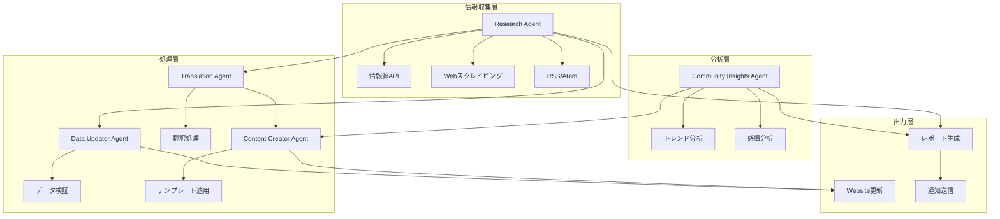

# AI Code Ecosystem Japan - エージェントシステム

## 🤖 概要

AI Code Ecosystem Japanのエージェントシステムは、サイトの情報を常に最新かつ高品質に保つための自動化システムです。5つの専門エージェントが協調して動作し、24時間365日体制で情報収集、更新、コンテンツ生成を行います。

## 📌 システム構成



## 🎯 各エージェントの詳細

### 1. Research Agent（調査エージェント）
**役割**: AIツールの最新情報を収集・分析

#### 主要機能
- GitHubリリースの監視
- 公式ブログのRSS購読
- 価格変更の検出
- 新機能のトラッキング

#### 実行スケジュール
- 日次: 6:00, 12:00, 18:00 (JST)
- 週次レポート: 月曜 9:00 (JST)

#### 出力
- JSON形式の更新レポート
- Markdown形式のサマリー
- 重要更新の通知

### 2. Content Creator Agent（コンテンツ作成エージェント）
**役割**: 非エンジニア向けの分かりやすいコンテンツを生成

#### 主要機能
- 初心者向けガイドの作成
- ツール比較記事の生成
- ユースケースの作成
- 専門用語の平易化

#### テンプレート
- `beginner_guide.md`: 初心者向けガイド
- `comparison.md`: ツール比較
- `use_case.md`: 実践例（準備中）

### 3. Data Updater Agent（データ更新エージェント）
**役割**: サイトのデータファイルを自動更新

#### 主要機能
- `/src/lib/data.ts`の更新
- 価格情報の更新
- バージョン情報の更新
- リンクチェック

#### バックアップ機能
- 更新前の自動バックアップ
- 30日間の履歴保持
- ロールバック機能

### 4. Translation Agent（翻訳エージェント）
**役割**: 英語コンテンツの高品質な日本語化

#### 主要機能
- 技術文書の正確な翻訳
- 専門用語の一貫性維持
- 文化的コンテキストの追加

### 5. Community Insights Agent（コミュニティ分析エージェント）
**役割**: ユーザーニーズとトレンドの分析

#### 主要機能
- SNSトレンド分析
- よくある質問の収集
- ユーザーフィードバック分析
- コンテンツ需要予測

## 🚀 セットアップ

### 前提条件
- Node.js 20以上
- TypeScript
- GitHub Actions（自動実行用）

### インストール
```bash
# プロジェクトルートで実行
npm install

# TypeScript関連
npm install -g ts-node typescript

# 依存パッケージ
npm install js-yaml
```

### 環境変数
```bash
# .env.local に設定
GITHUB_TOKEN=your_github_token
TWITTER_BEARER_TOKEN=your_twitter_token
SLACK_WEBHOOK_URL=your_slack_webhook
```

## 💻 手動実行

### Research Agent
```bash
# 更新チェック
ts-node agents/research/scripts/check_updates.ts

# 週次レポート生成
ts-node agents/research/scripts/generate_report.ts
```

### Data Updater Agent
```bash
# データ更新
ts-node agents/updater/scripts/update_data.ts

# リンクチェック（実装予定）
ts-node agents/updater/scripts/validate_links.ts
```

## ⚙️ 設定ファイル

### メイン設定
- `agents/config/agents.yaml`: エージェント設定
- `agents/config/sources.yaml`: 情報源設定
- `agents/config/schedules.yaml`: スケジュール設定（準備中）

### GitHub Actions
- `.github/workflows/agent-daily-update.yml`: 日次更新
- `.github/workflows/agent-weekly-report.yml`: 週次レポート

## 📊 モニタリング

### ダッシュボード（計画中）
- `/admin/agents`: エージェント状態
- `/admin/reports`: レポート一覧
- `/admin/logs`: 実行ログ

### ログファイル
```
logs/agents/
├── research/
│   ├── 2025-08-29.log
│   └── errors.log
├── updater/
│   └── 2025-08-29.log
└── content/
    └── 2025-08-29.log
```

## 🔧 トラブルシューティング

### よくある問題

#### 1. エージェントが実行されない
```bash
# GitHub Actionsのログを確認
gh run list --workflow=agent-daily-update.yml
gh run view [RUN_ID]
```

#### 2. データ更新が反映されない
```bash
# バックアップから復元
cp agents/updater/backups/data-backup-[timestamp].ts src/lib/data.ts
```

#### 3. レポートが生成されない
```bash
# 手動で週次レポートを生成
ts-node agents/research/scripts/generate_report.ts
```

## 📈 パフォーマンス指標

### 目標値
- 情報収集: 6時間以内に最新情報を検出
- データ更新: 24時間以内にサイト反映
- コンテンツ生成: 週3本以上の新規記事
- エラー率: 1%未満

### 現在の状態
- ✅ Research Agent: 稼働中
- ✅ Data Updater: 稼働中
- 🚧 Translation Agent: 実装中
- 🚧 Content Creator: 部分実装
- 📅 Community Insights: 計画中

## 🛣️ ロードマップ

### Phase 1 (完了)
- ✅ 基本的なエージェント構造
- ✅ Research Agentの実装
- ✅ Data Updaterの実装
- ✅ GitHub Actions設定

### Phase 2 (進行中)
- 🚧 Translation Agentの実装
- 🚧 Content Creatorの強化
- 🚧 エラーハンドリング改善

### Phase 3 (計画中)
- 📅 Community Insights Agent
- 📅 管理ダッシュボード
- 📅 AIモデル統合（GPT-4, Claude）
- 📅 自動A/Bテスト

## 🤝 貢献方法

### エージェントの改善
1. 新しい情報源の追加
2. テンプレートの改善
3. エラーハンドリングの強化

### 新規エージェントの提案
1. Issue作成
2. 設計ドキュメント作成
3. プロトタイプ実装
4. Pull Request

## 📝 ライセンス

このプロジェクトはMITライセンスの下で公開されています。

## 📞 サポート

### 問題報告
- GitHub Issues: [リンク]
- メール: agents@ai-code-ecosystem.jp

### ドキュメント
- [エージェント設計書](docs/AGENT_DESIGN.md)
- [API仕様書](docs/API_SPEC.md)
- [運用マニュアル](docs/OPERATION.md)

---

*最終更新: 2025年8月30日*
*バージョン: 1.0.0*