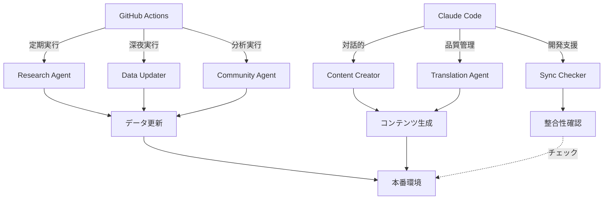

# エージェント実行モード設定

## 概要
各エージェントの実行環境と責任分担を定義します。

## 実行モード

### GitHub Actions (自律実行)
24/7で自動実行されるエージェント。外部データ収集や定期更新を担当。

| エージェント | 実行タイミング | 主な役割 |
|------------|-------------|---------|
| Research Agent | 毎日6,12,18時 | AIツール最新情報の収集 |
| Data Updater Agent | 毎日深夜2時 | data.tsの自動更新 |
| Community Insights Agent | 毎日10時 | SNS・コミュニティ分析 |

### Claude Code (対話的実行)
開発者のセッション内で実行。品質保証や対話的なコンテンツ生成を担当。

| エージェント | 実行タイミング | 主な役割 |
|------------|-------------|---------|
| Content Creator Agent | オンデマンド | 非エンジニア向けコンテンツ作成 |
| Translation Agent | オンデマンド | 英語→日本語の高品質翻訳 |
| Sync Checker | 開発時 | データ整合性チェック |

## 実行フロー



## コマンド

### GitHub Actions (自動実行)
```bash
# 手動トリガー（GitHub UI経由）
# Actions → 該当ワークフロー → Run workflow
```

### Claude Code (ローカル実行)
```bash
# Content Creator実行
ts-node agents/content/scripts/create_content.ts

# 同期チェック実行
ts-node agents/sync/check_sync.ts

# 翻訳エージェント実行（今後実装）
ts-node agents/translator/scripts/translate.ts
```

## 設定ファイル

### agents.yaml
各エージェントに`execution_mode`フィールドを追加：
- `github_actions`: GitHub Actionsで実行
- `claude_code`: Claude Codeセッション内で実行

### 環境変数
```env
# GitHub Actions用
GITHUB_TOKEN=xxx
TWITTER_BEARER_TOKEN=xxx

# Claude Code用
CLAUDE_SESSION=true
INTERACTIVE_MODE=true
```

## トラブルシューティング

### データ不整合が発生した場合
1. `ts-node agents/sync/check_sync.ts`を実行
2. 推奨アクションに従って修正
3. git push で同期

### エージェントが動作しない場合
1. execution_modeを確認
2. 必要な環境変数を確認
3. ログを確認（GitHub Actions → 該当ワークフロー）

## ベストプラクティス

1. **自律実行タスク**: データ収集や定期更新はGitHub Actions
2. **対話的タスク**: コンテンツ生成や品質チェックはClaude Code
3. **同期確認**: 開発前後で必ずcheck_sync.tsを実行
4. **エラー対応**: GitHub Actionsのエラーは自動リトライ、Claude Codeは手動修正

## 今後の拡張

- [ ] Translation Agentの実装
- [ ] エラー通知システムの構築
- [ ] ダッシュボードでの実行状態可視化
- [ ] Claude Code Task APIの活用検討